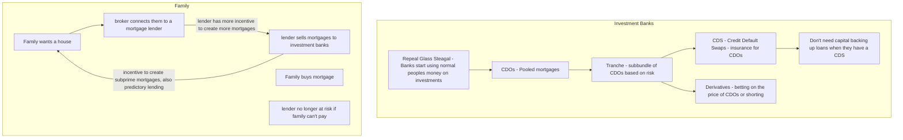
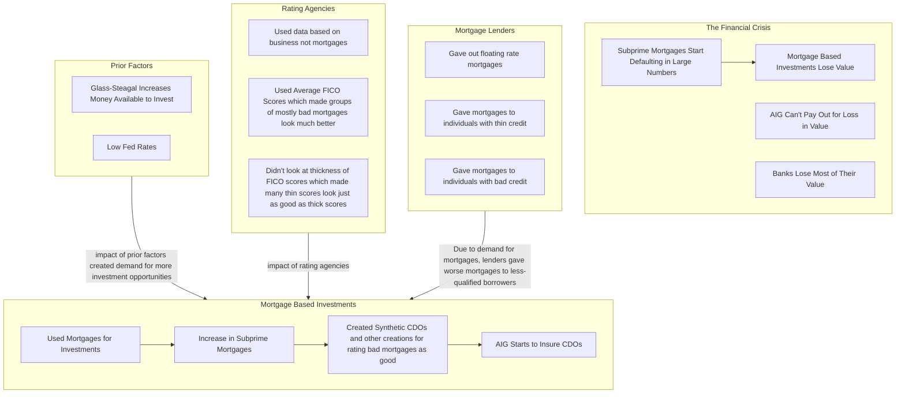
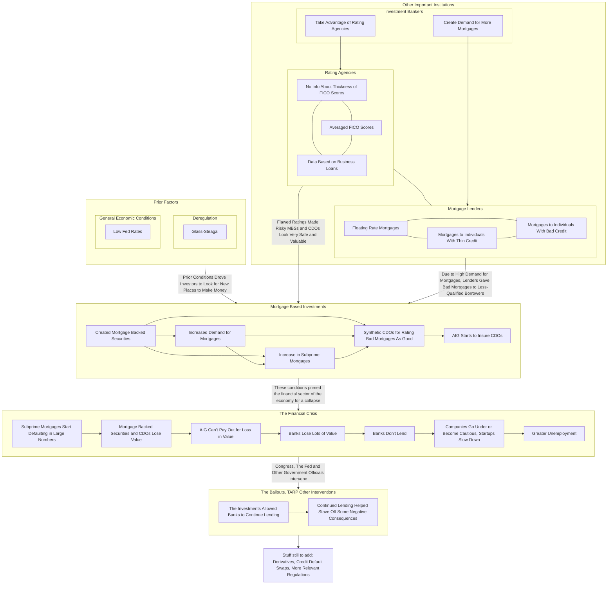

# Markdown Resources

## Guides and specifications

- [Github flavored markdown specification](https://github.github.com/gfm/)
    - [Cheatsheet](https://github.com/adam-p/markdown-here/wiki/Markdown-Cheatsheet)
- [MarkdownGuide](https://www.markdownguide.org/)

## Useful utilities

- [Tables Generator](http://www.tablesgenerator.com/markdown_tables)
- [Table to Markdown](https://tabletomarkdown.com/)

## Citeproc examples and resources

pandoc-citeproc is a pandoc "extension" of sorts that allows you to use citations in your markdown documents see [pandoc](../../OtherSoftware/PandocCommands.md) for more details

## Mermaid.js

- [Mermaid.js](https://mermaid.js.org/) is a "diagramming and charting tool" that can be used in markdown to create complicated flowcharts.
    - I use this with the [VSCode extension vscode-markdown-mermaid](https://github.com/mjbvz/vscode-markdown-mermaid) to view the results.
        - I then use the [live editor](https://mermaid.live/edit) to export the diagrams into `.svg` or `.png` formats (other formats are available too). These are found under the "Actions" tab.
    - [Documentation can be found at this link](https://mermaid.js.org/intro/).

